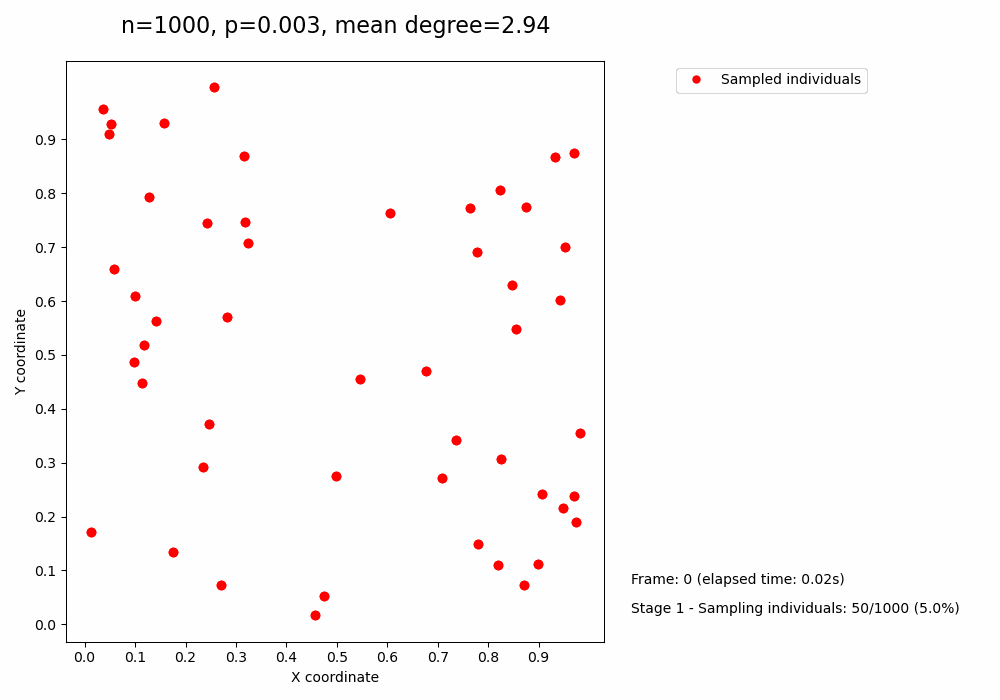

# Geographical-based friendship network<!-- omit in toc-->

Luca Di Bello, University of Italian Switzerland (USI), 2023

## Showcase<!-- GIFS -->

<table style="width:100%">
  <tr>
    <th>Purely random friendship network</th>
    <th>Geographical-based friendship network</th>
  </tr>
  <tr>
    <td>
      
    </td>
    <td>
      
    </td>
  </tr>
</table>

> Note: The GIFs above are just a small sample of the pre-computed simulations. The full set of simulations can be found in the `assets` folder or in the *Jupyter Notebook* project.

## Table of contents<!-- omit in toc-->

- [Geographical-based friendship network](#geographical-based-friendship-network)
  - [Showcase](#showcase)
  - [Table of contents](#table-of-contents)
  - [Project description](#project-description)
  - [Inhabitant maps](#inhabitant-maps)
    - [Purely random map](#purely-random-map)
    - [Geographical-based random map](#geographical-based-random-map)
  - [Friendship networks](#friendship-networks)
  - [Project](#project)
  - [Getting started](#getting-started)

## Project description

Social networks are systems that map the relationships and interactions between individuals. Although social networks are typically dynamic, the focus of this project is put on a static example.

Geographical distance plays a crucial role in social network formation, with closer physical proximity typically leading to more frequent and stronger social ties.

Additionally, geographical features, such as the density of people in an area (more in cities and less in remote mountainous regions), profoundly influence the composition and scale of these networks, shaping the diversity and connectivity of communities within a given region.

## Inhabitant maps

The project features two kinds of inhabitant maps:

### Purely random map

1000 inhabitants are randomly distributed across a unit square map, $[0,1]^2$. Each individual is assigned a uniform random position $(x,y)$ in the map.

### Geographical-based random map

This map features several geographical areas $F$, such as cities, mountains, and lakes. The inhabitants are randomly distributed across the map, but the density of inhabitants is higher in cities and lower in mountains and lakes. The function $f$ maps the coordinates $(x, y)$ of an individual to the geographical area $f$ in which the individual is located.

$$
f(x,y) = \text{geographical area in which individual } (x,y) \text{ is located}
$$

In this map, individuals are no longer distributed uniformly at random across the map. Instead, the density of inhabitants depends on specific geographical features: each area has a positive factor that determines the ease of living there:

$$
\begin{equation*} \tag{1}
s_f = \text{ease of living in area } f \ \forall f \in F
\end{equation*}
$$

The probability of a random individual being located in coordinates $(x,y)$ is the following:

$$
\begin{equation} \tag{2}
P(\text{random person settles in } (x,y)) = \frac{s_{f(x,y)}}{\sum_{(x',y') \in \text{Map}} s_{f(x',y')}}
\end{equation}
$$

## Friendship networks

From the inhabitant maps, a friendship network is created following two different models:

**Map 1 - Erdős–Rényi model**: The friendships are modeled as an *Erdős–Rényi* random graph. Each individual has a probability $p$ of being friends with another individual, and this probability $p$ is identical for all possible pairs of individuals

**Map 2 - Geographical model**: The probability of a friendship between two individuals A and B is modeled as follows:

$$
\begin{equation*} \tag{3}
P(A - B) = e^{-\beta \, d(A,B)}
\end{equation*}
$$

Where $d(A,B)$ is the Euclidean distance between $A$ and $B$ and $\beta$ is a parameter that determines the strength of the geographical effect. The higher the value of $\beta$, the more likely it is that two individuals will be friends if they are close to each other.

## Project

The project is available as a *Jupyter Notebook* and can be found [here](https://nbviewer.org/github/lucadibello/geographical-friendship-network/blob/main/geographical-friendship-network.ipynb) (nbviewer.org).

> Alternatively, the notebook can be viewed directly on GitHub [here](./notebooks/geographical-friendship-network.ipynb).

## Getting started

It is advised to use the provided *environment.yml* file to create a new *conda* environment with all the required dependencies by executing the following command:

```bash
conda env create -f environment.yml
```
